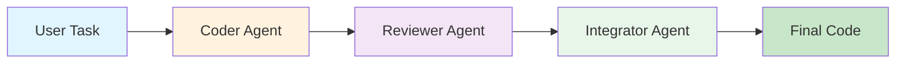

# AutoGen 三代理工作流 (Three-Agent Workflow)

> 基于 AutoGen 0.6.4 构建的智能代码生成工作流系统

[](https://github.com/microsoft/autogen)
[](https://www.python.org/)
[](LICENSE)

## ✨ 特性

- 🤖 **三代理协作**: Coder（编写代码）→ Reviewer（审查改进）→ Integrator（整合优化）
- 🧠 **智能选择**: 支持 RoundRobin 和 SelectorGroupChat 两种模式
- 💾 **状态管理**: 保存/恢复会话状态，支持中断后继续
- 🛡️ **多重保护**: 文本终止、消息限制、超时保护、源匹配
- 📊 **详细记录**: Markdown 格式的执行日志，便于审计和调试
- 🎨 **友好输出**: 集成 AutoGen Console UI，提供清晰的格式化输出
- ⚡ **高效预筛选**: 候选函数预筛选，减少 LLM 调用开销

## 🚀 快速开始

### 安装

```bash
# 克隆项目
git clone <your-repo-url>
cd autogen_test

# 安装依赖
pip install -r requirements.txt

# 配置 API Key
echo "MISTRAL_API_KEY=your_key_here" > .env
```

### 基本使用

```bash
# 简单任务
python improved_three_agent_workflow.py --task "编写一个CSV转JSON的Python脚本"

# 智能选择器模式
python improved_three_agent_workflow.py --task "实现快速排序" --use-selector

# 保存配置
python improved_three_agent_workflow.py --task "REST API客户端" --save-config

# 从状态恢复
python improved_three_agent_workflow.py --resume task_md/team_state_1.json
```

完整使用指南请查看 [快速开始文档](QUICKSTART.md)

## 📖 文档

- 📘 [快速开始指南](QUICKSTART.md) - 5分钟上手
- 📗 [优化指南](OPTIMIZATION_GUIDE.md) - 详细的优化说明和最佳实践
- 📕 [更新日志](CHANGELOG.md) - 版本变更历史

## 🎯 工作流程



1. **Coder**: 根据需求编写初始代码
2. **Reviewer**: 审查代码并提出改进建议
3. **Integrator**: 整合建议，产出最终优化代码

## 🔧 核心功能

### 两种工作模式

#### RoundRobin 模式（默认）

- 固定顺序轮流发言
- 简单可靠，适合标准流程

#### Selector 模式（`--use-selector`）

- 基于消息内容智能选择
- 灵活高效，适合复杂场景

### 智能终止条件

```python
termination = (
    TextMentionTermination("TERMINATE") |     # 关键词检测
    MaxMessageTermination(20) |               # 消息数限制
    TimeoutTermination(600) |                 # 超时保护
    SourceMatchTermination(["integrator"])    # 源代理匹配
)
```

### 状态管理

支持保存和恢复完整的对话状态：

```bash
# 执行任务（自动保存状态）
python improved_three_agent_workflow.py --task "复杂任务"

# 如果中断，可以恢复
python improved_three_agent_workflow.py --resume task_md/team_state_1.json
```

## 📊 示例输出

### 控制台输出

```
============================================================
开始执行任务 (执行编号: 1)
============================================================

使用 RoundRobinGroupChat 模式（轮流发言）

────────────────────────────────────────────────────────────
📤 coder
────────────────────────────────────────────────────────────
```python
import csv
import json

def csv_to_json(csv_file, json_file):
    """将CSV文件转换为JSON格式"""
    data = []
    with open(csv_file, 'r', encoding='utf-8') as f:
        reader = csv.DictReader(f)
        for row in reader:
            data.append(row)
    
    with open(json_file, 'w', encoding='utf-8') as f:
        json.dump(data, f, ensure_ascii=False, indent=2)

if __name__ == "__main__":
    csv_to_json("input.csv", "output.json")
```

────────────────────────────────────────────────────────────
📤 reviewer
────────────────────────────────────────────────────────────
改进建议：

1. 添加错误处理（文件不存在、编码错误）
2. 支持命令行参数
3. 添加类型提示
4. 增加文档字符串
5. 处理空CSV文件的情况
...

```

### Markdown 记录

自动生成详细的执行记录：`task_md/task_record_1.md`

## ⚙️ 配置选项

| 参数 | 说明 | 默认值 |
|------|------|--------|
| `--task` | 开发需求描述 | 必填（或交互输入） |
| `--use-selector` | 启用智能选择器 | False |
| `--save-config` | 保存团队配置 | False |
| `--resume` | 从状态文件恢复 | None |
| `--timeout` | 超时时间（秒） | 600 |
| `--no-console-ui` | 禁用 Console UI | False |
| `--mistral-api-key` | API Key | 从 .env 读取 |
| `--mistral-base-url` | API 端点 | https://api.mistral.ai/v1 |

## 🎓 高级用法

### 自定义代理

可以修改 `build_agents()` 函数来自定义代理行为：

```python
def build_agents(model_client):
    coder = AssistantAgent(
        name="coder",
        model_client=model_client,
        description="自定义描述",
        system_message="自定义系统消息",
        # tools=[your_custom_tools],  # 添加工具
    )
    # ...
```

### 自定义选择器

修改 `create_selector_func()` 来实现自定义选择逻辑：

```python
def create_selector_func():
    def selector_func(messages):
        # 自定义选择逻辑
        if some_condition:
            return "specific_agent"
        return None  # 让 LLM 选择
    return selector_func
```

### 集成到应用

```python
import asyncio
from improved_three_agent_workflow import run_workflow

async def main():
    await run_workflow(
        task="你的任务",
        use_selector=True,
        timeout_seconds=1200
    )

asyncio.run(main())
```

## 📈 性能优化

- ✅ 候选函数预筛选（减少 LLM 选择开销）
- ✅ 状态管理（避免重复执行）
- ✅ 智能终止条件（防止无限循环）
- ✅ 可配置超时（资源保护）

## 🔍 故障排除

### 常见问题

**Q: API Key 错误**

```bash
# 检查 .env 文件
cat .env

# 或显式提供
python improved_three_agent_workflow.py --mistral-api-key your_key --task "..."
```

**Q: 任务超时**

```bash
# 增加超时时间
python improved_three_agent_workflow.py --task "..." --timeout 1800
```

**Q: 选择器行为异常**

```bash
# 切换到 RoundRobin 模式
python improved_three_agent_workflow.py --task "..."  # 不使用 --use-selector
```

更多问题请查看 [FAQ](QUICKSTART.md#常见问题)

## 🛠️ 技术栈

- **框架**: [AutoGen](https://microsoft.github.io/autogen/) 0.6.4
- **语言**: Python 3.8+
- **依赖**:
  - `autogen-agentchat`: 多代理聊天
  - `autogen-ext[openai]`: OpenAI 扩展
  - `python-dotenv`: 环境变量管理

## 📝 更新日志

### v2.0 (2025-11-04)

- 🎉 基于 AutoGen 0.6.4 全面重构
- ✨ 添加智能选择器和候选函数
- 💾 实现状态管理（保存/恢复）
- 🛡️ 增强终止条件（超时、源匹配）
- 🎨 集成 Console UI
- 🔧 完善异常处理

详细更新请查看 [CHANGELOG.md](CHANGELOG.md)

## 🤝 贡献

欢迎提交 Issue 和 Pull Request！

### 贡献指南

1. Fork 本项目
2. 创建特性分支 (`git checkout -b feature/AmazingFeature`)
3. 提交更改 (`git commit -m 'Add some AmazingFeature'`)
4. 推送到分支 (`git push origin feature/AmazingFeature`)
5. 开启 Pull Request

## 📄 许可证

本项目采用 MIT 许可证 - 查看 [LICENSE](LICENSE) 文件了解详情

## 🙏 致谢

- [Microsoft AutoGen](https://github.com/microsoft/autogen) - 优秀的多代理框架
- [Mistral AI](https://mistral.ai/) - 强大的语言模型

## 📧 联系方式

- Issue Tracker: [GitHub Issues](your-repo-url/issues)
- 文档: [Documentation](QUICKSTART.md)

---

⭐ 如果这个项目对你有帮助，请给个 Star！

Made with ❤️ using AutoGen
